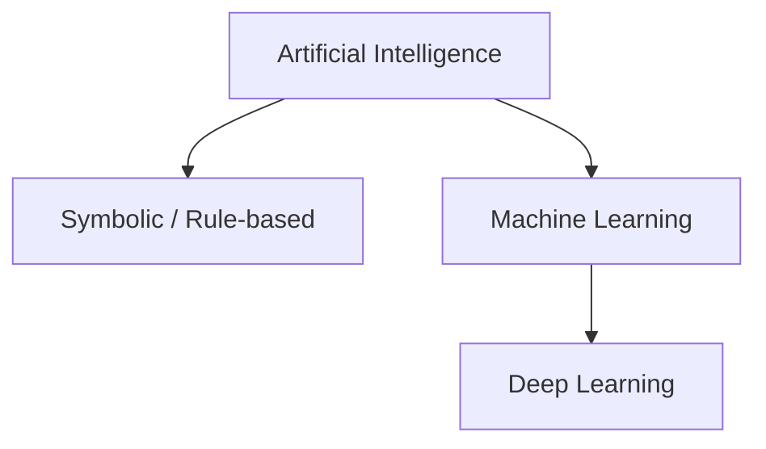
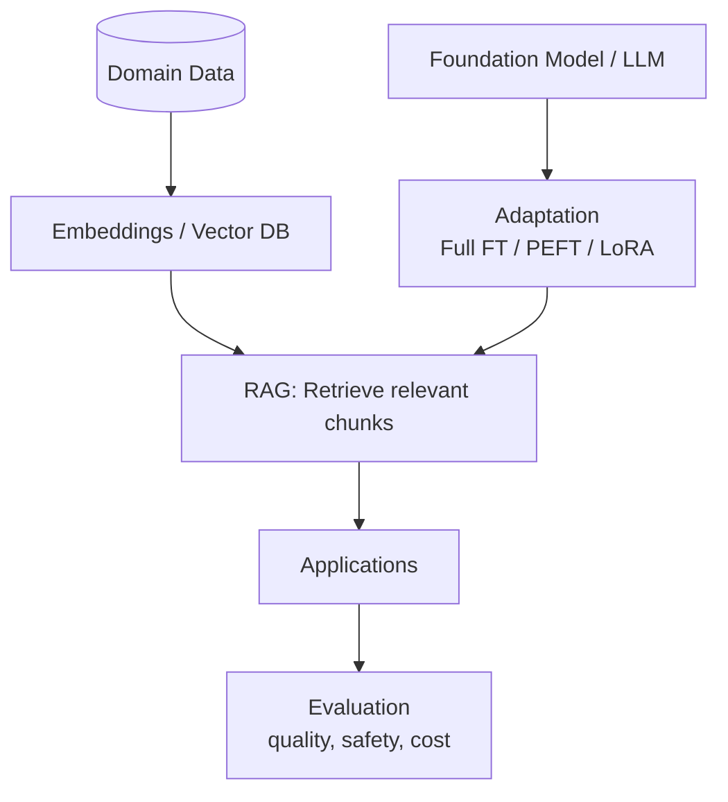

# 01 — AI → ML → DL → Generative AI (Foundations & Roadmap)

> **Source:** Rewritten from Page 1 of my handwritten notes (images folder). This is a long‑form, fully expanded version with clear structure, examples, and diagrams. All later pages (preprocessing, vectorization, TF‑IDF, embeddings, Transformers, RAG, agents) build on this orientation page.

---

## Table of Contents
1. [What is Artificial Intelligence?](#what-is-artificial-intelligence)
2. [Machine Learning (ML)](#machine-learning-ml)
   - Learning paradigms and examples
3. [Deep Learning (DL)](#deep-learning-dl)
   - CNN / RNN / Transformers / Representation Learning
4. [Discriminative vs. Generative Models](#discriminative-vs-generative-models)
5. [Generative AI (Text Focus)](#generative-ai-text-focus)
   - LLMs, Adaptation (FT/PEFT/LoRA), RAG, Vector DBs, Evaluation
6. [Agentic AI](#agentic-ai)
7. [My Professional Roadmap](#my-professional-roadmap)
8. [Glossary](#glossary)
9. [Pointers to the Next Pages](#pointers-to-the-next-pages)

---

## What is Artificial Intelligence?
**Artificial Intelligence (AI)** is the discipline of building computer systems that perform tasks that normally require human intelligence: perception, reasoning, learning, understanding language, and decision‑making. In practice we combine two complementary approaches:

- **Symbolic / Rule‑based AI (Classical AI):** Knowledge is expressed as rules and logic (e.g., expert systems, search/heuristics, constraint solvers, knowledge graphs). Works well when rules are clear and stable, and when data is scarce.
- **Statistical / Learning‑based AI:** Systems *learn* patterns from data (Machine Learning and Deep Learning). Dominant in perception (vision, speech) and language, where handcrafted rules don’t scale.



---

## Machine Learning (ML)
**ML** learns a mapping from inputs to outputs (or discovers structure) from data.

### Learning paradigms
```mermaid
flowchart LR
D[Data] --> S[Supervised Learning\n(input + label)]
D --> U[Unsupervised Learning\n(input only)]
D --> SS[Semi‑supervised]
D --> RL[Reinforcement Learning\n(reward signals)]
```
- **Supervised:** Train on labeled pairs `(x, y)`.
  - *Classification:* spam vs. ham, sentiment (+/0/−), intent/category.
  - *Regression:* predict a number (rating, price, time‑to‑resolution).
  - *Typical models:* Logistic/Linear Regression, SVM, Decision Trees/Random Forests, Gradient Boosting, Neural Networks.
- **Unsupervised:** Find structure without labels (clustering, dimensionality reduction).
  - *Models:* K‑Means, DBSCAN, PCA, t‑SNE/UMAP.
- **Semi‑supervised:** Use a small labeled set with a large unlabeled set.
- **Reinforcement Learning (RL):** Learn actions that maximize cumulative reward via interaction (games/robotics); policies optimized via Q‑learning, policy gradients, actor‑critic.

**Key idea:** ML turns *data* into *features* (representations) that a model can reason with. In traditional NLP, we manually craft features (BoW/TF‑IDF). In DL, the model learns features automatically.

---

## Deep Learning (DL)
**DL** uses neural networks with many layers to learn hierarchical representations directly from data.

```mermaid
flowchart TB
subgraph DL[Deep Learning]
NLP[NLP]
CNN[CNN (images)]
RNN[RNN/LSTM/GRU (sequences)]
TR[Transformers (self‑attention)]
REP[Representation Learning]
end
NLP --> TR
RNN --> TR
```

- **CNNs:** Convolutions + pooling learn spatial features (images/audio spectrograms). Often used for text as 1‑D convolutions over embeddings in older setups.
- **RNNs / LSTM / GRU:** Sequence models that maintain a hidden state; capture word order and temporal dependencies. LSTM/GRU mitigate vanishing gradients.
- **Transformers:** Replace recurrent computation with **self‑attention** so every token can attend to every other token in a sequence. They scale well and power today’s leading NLP systems.
- **Representation Learning:** DL models learn useful intermediate features automatically, reducing manual feature engineering.

**NLP with DL basics**
- Tokenization (often **subwords** via BPE/WordPiece)
- Embeddings: static (word2vec/GloVe) vs. contextual (BERT‑like)
- Encoder/decoder stacks, positional encodings, attention heads
- Task heads: classification, sequence labeling, generation (LM, QA, summarization, translation)

---

## Discriminative vs. Generative Models
- **Discriminative** models learn \(p(y\mid x)\): directly map input to label (e.g., spam classifier).
- **Generative** models learn \(p(x)\) or \(p(x\mid c)\): *generate* text/code/images conditioned on context (e.g., next‑token prediction for language models).

**Why it matters:** Generative models can create content, simulate continuations, or paraphrase; discriminative models classify or score content. Many real systems combine both (e.g., a generative model guided by a discriminative reranker).

---

## Generative AI (Text Focus)
**Generative AI** creates new text conditioned on prompts and optional external knowledge.



### Components
- **Foundation Models / LLMs**: Large decoder‑only Transformers pre‑trained on massive corpora with next‑token prediction. They learn general language skills and world knowledge.
- **Adaptation**
  - *Full fine‑tuning:* update all parameters on your task/domain.
  - *Parameter‑Efficient Fine‑Tuning (PEFT)* such as **LoRA**: inject small trainable adapters; update a tiny fraction of weights—cheaper and often sufficient.
  - *Prompt/Instruction tuning:* steer behavior via curated prompts and small additional training.
- **RAG — Retrieval‑Augmented Generation**: Retrieve top‑k passages (via **vector similarity**) from your documents and provide them to the LLM so outputs are grounded and up‑to‑date.
- **Vector Databases**: Store high‑dimensional embeddings with approximate nearest‑neighbor (ANN) indexes for fast semantic search.
- **Evaluation**: Intrinsic metrics (accuracy, Rouge, BLEU), human eval, groundedness/faithfulness checks, cost/latency monitoring, and safety/guardrails.

**Example (domain QA bot):**
1. Chunk & embed PDFs/wiki pages; index in a vector DB.  
2. At query time, embed the question and retrieve top‑k chunks by **cosine similarity**.  
3. Construct a prompt with the retrieved text.  
4. Generate an answer with citations; log and evaluate.

---

## Agentic AI
Agentic systems **plan**, **call tools/APIs**, **use memory**, and perform **multi‑step** workflows to achieve goals.

```mermaid
flowchart LR
U[User Goal] --> P[Planner]
P -->|selects| TOOLS[Tool Calls\n(search, DB, code, APIs)]
P --> MEM[Memory\n(short/long‑term)]
TOOLS --> EX[Executor]
EX --> OBS[Observation]
OBS -->|feedback| P
P --> RES[Result]
```

**Building blocks**
- **Planner/Controller:** chooses next action (rule‑based or learned).
- **Tools:** web/search, databases, code execution, file I/O, calculators, product APIs.
- **Memory:** conversation history, retrieved facts, user profile, vector memories.
- **Orchestration:** single agent or **multi‑agent** graphs (retriever, coder, reviewer) with evaluation loops.

**Use cases:** research copilots, data wrangling pipelines, customer support copilots, autonomous regression testing workflows, etc.

---

## My Professional Roadmap
This roadmap expands the bullets from the page into concrete milestones and deliverables.

```mermaid
flowchart TB
A[NLP (Basics)] --> B[DL (Basics)] --> C[NLP (Advanced)] --> D[LLMs]
D --> E[Fine‑tuning & PEFT]
E --> F[RAG + Vector Search]
F --> G[Agentic Systems & Apps]
```

1) **NLP (Basics)** — *Tokenizer & classic features*  
- Tokenization, normalization, stopwords, stemming vs. lemmatization, BoW/TF‑IDF, cosine similarity, n‑grams.  
- **Deliverable:** `02-preprocessing.ipynb` + mini TF‑IDF spam classifier baseline.

2) **DL (Basics)** — *Embeddings & sequence models*  
- Static embeddings (word2vec/GloVe) vs. contextual. RNN (LSTM/GRU), CNN for text.  
- **Deliverable:** compare CNN vs. Bi‑LSTM on sentiment.

3) **NLP (Advanced)** — *Labeling & structure*  
- POS, NER, sequence labeling; CRF heads; error analysis; data augmentation.  
- **Deliverable:** BiLSTM‑CRF NER on a small public corpus.

4) **LLMs** — *Transformer internals & decoding*  
- Tokenization (BPE/WordPiece), positional encoding, attention heads, KV cache; decoding (greedy, beam, top‑k/top‑p), evaluation.  
- **Deliverable:** run a small open LLM for zero‑/few‑shot classification.

5) **Fine‑tuning & PEFT** — *Adapting foundation models*  
- Full FT vs. LoRA/PEFT; data curation; overfitting control; evaluation & reproducibility.  
- **Deliverable:** LoRA fine‑tune on a domain dataset.

6) **RAG & Vector Search** — *Grounding*  
- Chunking strategies, embedding models, ANN indexes, retrieval diagnostics, faithfulness evaluation.  
- **Deliverable:** minimal RAG app with quality dashboard.

7) **Agentic Systems & Apps** — *Tool use & planning*  
- Tool calling, memory, planning, guardrails; multi‑agent orchestration.  
- **Deliverable:** orchestrated agent demo with tests and telemetry.

---

## Glossary
- **Stopwords:** very frequent function words (e.g., *the, is, to*). Useful to remove in BoW/TF‑IDF baselines; keep negators (e.g., *not*).
- **Normalization:** lowercase, Unicode normalization, de‑contraction, punctuation/URL/email cleanup.
- **Embedding:** numeric vector representation of tokens, enabling similarity via metrics like cosine similarity.
- **Vector Database:** a store for embeddings with approximate nearest neighbor (ANN) indexes for fast similarity search.
- **PEFT / LoRA:** parameter‑efficient fine‑tuning methods that adapt big models by training small adapters.
- **RAG:** retrieval + generation for grounded, up‑to‑date answers.

---

## Pointers to the Next Pages
- **Page 2:** Text Preprocessing — tokenization, normalization, stopwords, stemming vs. lemmatization (with experiments).  
- **Page 3:** Classic Vectorization — OHE & BoW with tiny‑corpus tables.  
- **Page 4:** Similarity & N‑grams — cosine vs. Euclidean; phrases & negation.  
- **Page 5:** TF‑IDF — math + worked examples (ties to your hand tables).  
- **Page 6:** Embeddings & word2vec — CBOW vs. Skip‑gram; cosine semantics.  
- **Page 7+:** Transformers/LLMs, RAG, Agents.
