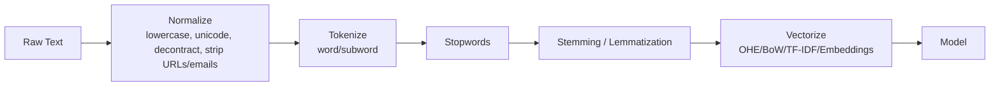

# 02 — Text Preprocessing (Normalization → Tokenization → Stopwords → Stemming/Lemmatization)

> **From pages:** Ambiguity note; stemming vs. lemmatization; terminology; your sentiment examples; pipeline sketch.

## Why Preprocess?
Preprocessing standardizes noisy text (URLs, casing, emoji, punctuation) and reduces sparsity.



### Terminology
- **Corpus** (all text); **Document** (email/review); **Sentence**; **Vocabulary**; **Token vs. Type**.

### Tokenization
- Word tokens vs. **subwords** (BPE/WordPiece) for OOV robustness.

### Stopwords
Remove frequent function words when using BoW/TF‑IDF (but keep **negators** like *not*).

### Stemming vs. Lemmatization
- **Stemming**: heuristic chop (fast, may produce non‑words).
- **Lemmatization**: POS + lexicon to valid lemma (accurate, slower).

### Example transformation
```
Input : "Hey, buddy, I want to go to your house?"
Tokens: [hey, buddy, i, want, to, go, to, your, house, ?]
After stopwords: [hey, buddy, want, go, house, ?]
```
