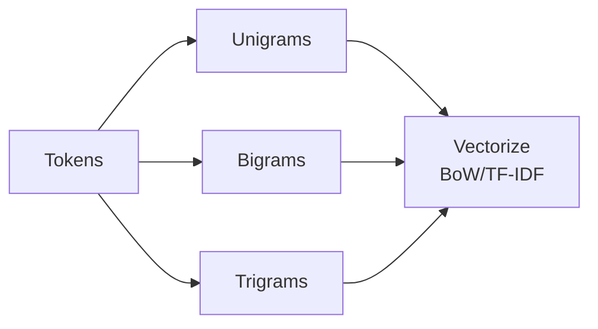

# 04 — Similarity Measures & N‑grams

> **From pages:** Euclidean vs. cosine, your angle table, and the note “to capture semantics we use N‑grams”.

## Euclidean Distance
\[ \mathrm{dist}(A,B) = \sqrt{\sum_i (A_i - B_i)^2} \]
Sensitive to document length and feature scaling.

## Cosine Similarity (preferred for sparse text)
\[ \cos\_\mathrm{sim}(A,B) = \frac{A\cdot B}{\lVert A\rVert\,\lVert B\rVert} \], \; \cos\_\mathrm{dist}=1-\cos\_\mathrm{sim} 

**Angle intuition**

| θ | sin θ | cos θ | Interpretation |
|--:|:-----:|:-----:|----------------|
| 0°   | 0   | 1    | identical direction |
| 30°  | .5  | .866 | high similarity |
| 90°  | 1   | 0    | unrelated |
| 180° | 0   | −1   | opposite |

> In high‑dimensional BoW/TF‑IDF spaces, cosine focuses on orientation (content) rather than magnitude (length).

## N‑grams — adding limited order
- **Unigrams**: `good`, `boy`  
- **Bigrams**: `good boy`  
- **Trigrams**: `new york city`

**Trade‑off**: higher *n* adds local context but increases dimensionality and sparsity.
