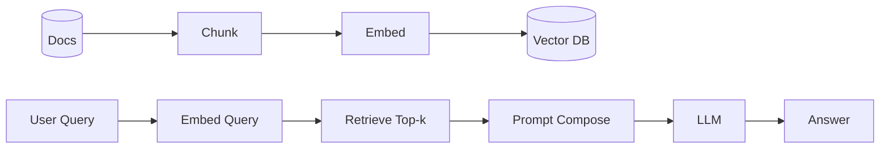

# 08 — Retrieval‑Augmented Generation (RAG) & Vector Search (Orientation)

## Pipeline

Topics: chunking strategies, embeddings choice, ANN indexes (HNSW/IVF), prompt templating, citation and hallucination checks, evaluation (faithfulness).
