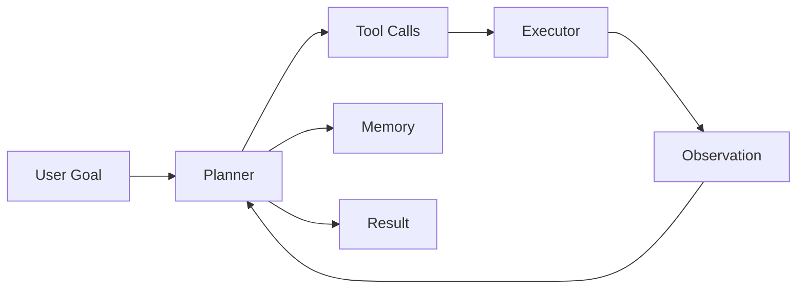

# 09 — Agents & Orchestration (Orientation)

```mermaid
flowchart LR
U[User Goal] --> P[Planner]
P --> T1[Tool Calls]
P --> MEM[Memory]
T1 --> EX[Executor]
EX --> OBS[Observation]
OBS --> P
P --> RES[Result]
```

Patterns: toolformer‑style calls, function routing, graph‑based workflows, evaluation loops, guardrails.
